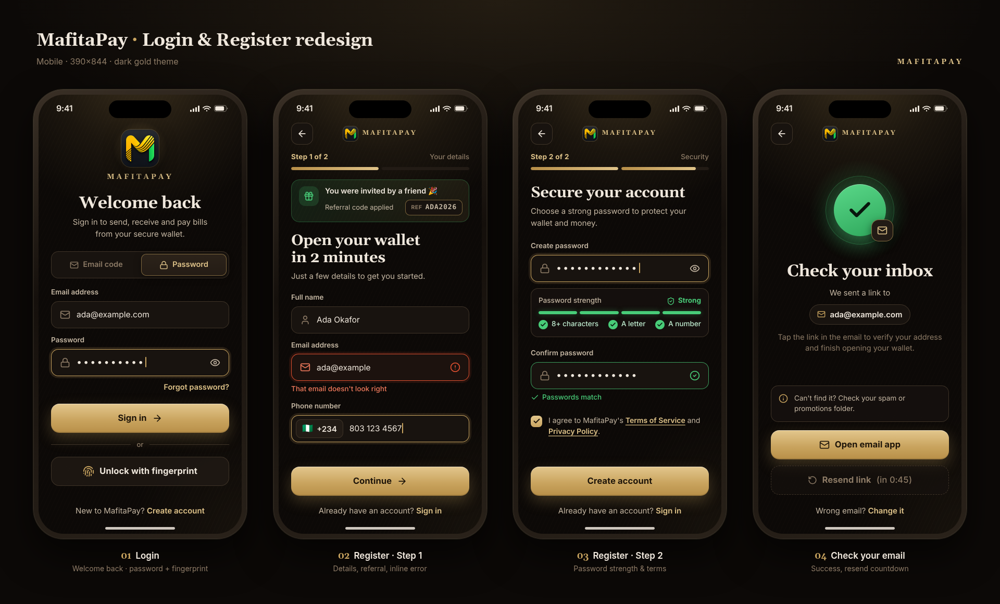
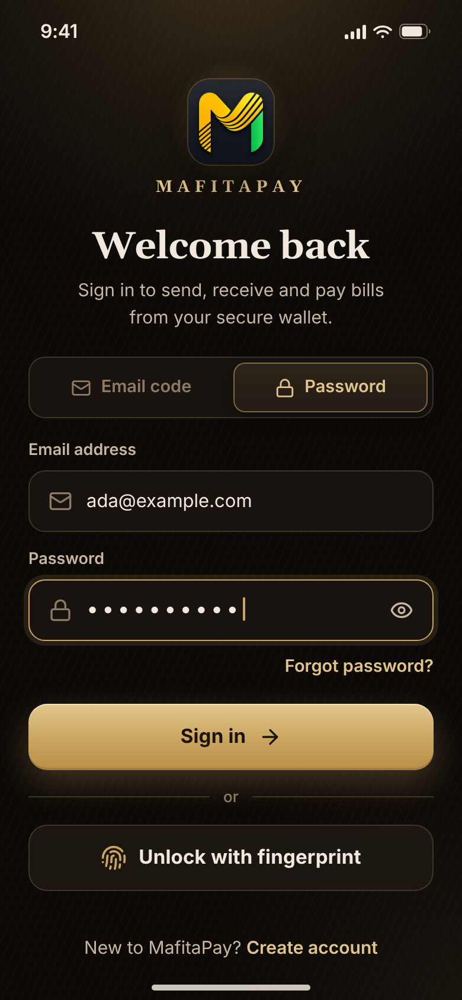
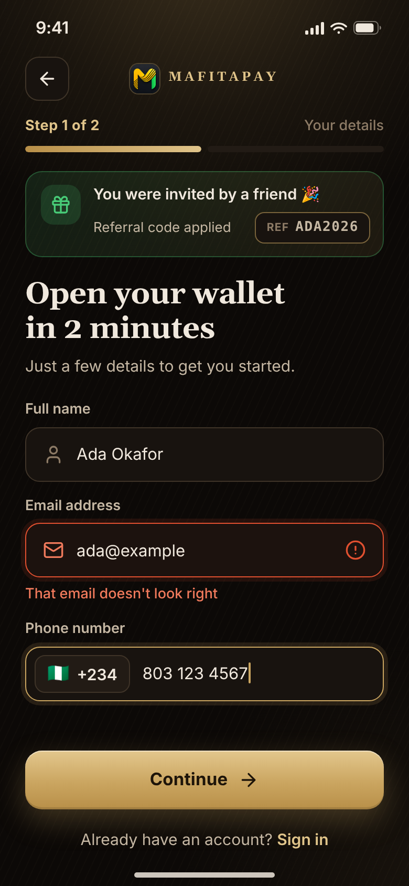
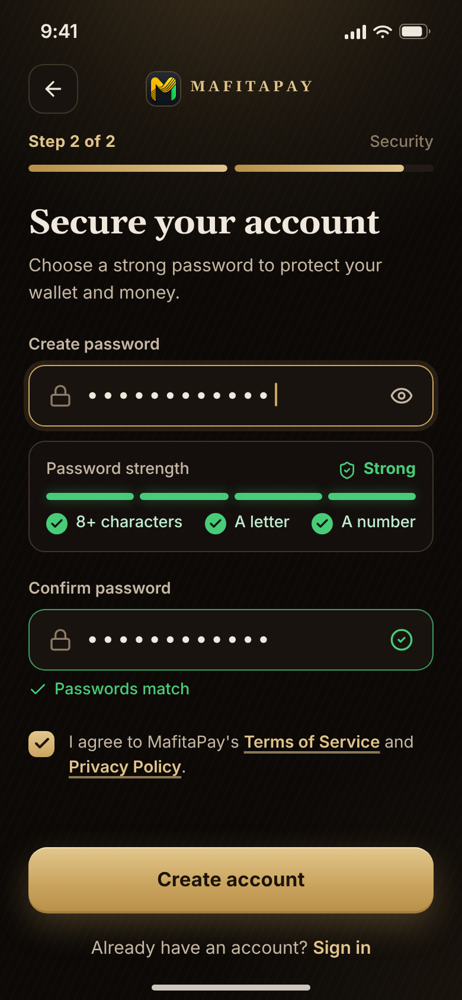
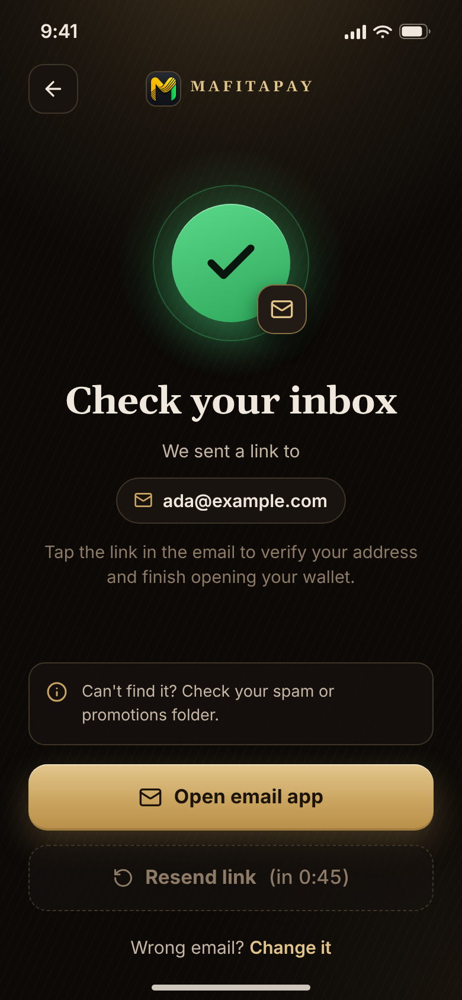

# MafitaPay — Login & Register Redesign: Implementation Plan

_Prepared 7 Oct 2026 (WAT). Based on the **current local working tree** of `C:\Users\zagal\mafitapay` (including uncommitted changes). All `file:line` references point at that tree._

> **⚠️ Do this first — commit the work-in-progress.**
> `git status` shows uncommitted changes in files this plan touches: `app/(auth)/login/page.tsx`, `app/(auth)/register/page.tsx`, `components/auth/AuthSplitShell.tsx`, `app/api/auth/route.ts`, `app/api/auth/forgot-password/route.ts`, `lib/server/auth.ts`, `lib/server/auth-delivery.ts`, `lib/server/data.ts`, `store/index.ts`, `capacitor.config.ts`, `MainActivity.java`, `package.json`, plus untracked `components/auth/PrivyAuthAction.tsx`, `app/api/auth/privy/`, `components/app/AppProviders.tsx`, `supabase/`.
> Commit them (or move them to their own branch) **before** starting, then create a feature branch, e.g. `git switch -c feat/auth-redesign`. This keeps the redesign diff reviewable and easy to roll back.

---

## Summary

Rebuild the auth screens to match the approved mockups (dark gold theme, mobile-first, 390×844 reference) while keeping the existing auth back end (`/api/auth`, Privy email codes, cookie session `mfp_session`) and adding a few targeted backend pieces:

| # | Change | Backend work? |
|---|--------|---------------|
| 1 | Mobile/native "welcome moment" (big glowing logo, wordmark, headline) | No |
| 2 | "Unlock with fingerprint" for returning users (Capacitor Android) | **Yes** — new device-login token table + 3 endpoints |
| 3 | Segmented "Email code \| Password" toggle (Privy only) | No (small refactor of `PrivyAuthAction`) |
| 4 | Register stepper, +234 chip, eye toggle, strength meter, "Passwords match" | No |
| 5 | Inline per-field errors with ARIA, validate on blur | No |
| 6 | Bigger type (≥13 px body) and ≥44 px tap targets | No |
| 7 | Terms/Privacy links, invite banner for `?ref=` | **Routes don't exist yet** (TODO pages) |
| 8 | "Check your inbox" screen: open email app, resend w/ 45 s countdown, change email | **Yes** — resend endpoint; optional change-email endpoint |
| 9 | Bugs: placeholder App Store link; dev-only verification link | Small server change |

Phases go from quick wins to riskiest: **bugs → type & primitives → layout/welcome → register → toggle → check-email → biometrics**.

### Approved mockups

| Overview |
|---|
|  |

| 01 Login | 02 Register · step 1 | 03 Register · step 2 | 04 Check email |
|---|---|---|---|
|  |  |  |  |

Mockup HTML/CSS source: [`mockups/src/`](mockups/src/) — `styles.css` is the source of truth for sizes/radii/colours, `build.py` the screen markup (re-render with `python build.py && python render.py`; needs Python Playwright + Chrome). The HTML references `../logo-320.png`, included in `mockups/`.

---

## Verified codebase facts (read before coding)

| Fact | Where |
|---|---|
| Next 16.2.3, React 19.2.4, Tailwind v4 (`@import 'tailwindcss'`), Capacitor **8.4.x**, Privy react-auth 3.47, lucide-react, zustand | `package.json:30-72`, `app/globals.css:1` |
| CSS vars (`--page-bg`, `--coal`, `--clay`, `--clay2`, `--border`, `--gold`, `--gold2`, `--text`, `--text2`, `--muted`, `--green2`, `--red`, `--red2`, `--gold-soft`, `--gold-tint`, `--font-display` Georgia); light overrides in `[data-theme="light"]` | `app/globals.css:3-35`, `:37-61` |
| `--green2` / `--red2` are **not** overridden in light theme (`#48cc78` on light bg is low-contrast text) | `app/globals.css:37-61` |
| `#app-root` is `height:100dvh; overflow:hidden` → auth screens must provide **their own scroll container** | `app/globals.css:110-118` |
| Compact (mobile/native) shell renders only a bare card | `components/auth/AuthSplitShell.tsx:50-60` |
| `Input` already has `error?: string` but: label is a 9 px `<div>` (not `<label>`), error is 10 px with no `aria-*`, error border uses `--red` | `components/ui/Input.tsx:10,18,19,43` |
| `Input` imported by **13** files, `Button` by **29**; no current caller passes `error=` | grep over `app/`, `components/` |
| `Button` is uppercase/tracking-wider, sizes 10–12 px, primary `bg-[var(--gold)] text-white` | `components/ui/Button.tsx:13,16,23-27` |
| Login: `privyEnabled` from `NEXT_PUBLIC_PRIVY_APP_ID`; mode switching via 11 px text links; one shared error box | `app/(auth)/login/page.tsx:12,19,89-107,128-134` |
| Register: 2 steps in password mode, `normalizePhone`, `validateProfile`, password rule (8+, letter, number), `?ref=` prefill, success overlay | `app/(auth)/register/page.tsx:20,41-47,49-56,58-69,87-94,252-268` |
| Same password rule on server | `app/api/auth/route.ts:34-36` |
| `normalizePhone` duplicated 3× (register page, PrivyAuthAction, API) | `register/page.tsx:49`, `PrivyAuthAction.tsx:21`, `api/auth/route.ts:15` |
| Terms/Privacy are plain text, not links | `register/page.tsx:168-170`, `:225-227` |
| **No `/terms` or `/privacy` route exists** (top-level `app/` has only `(auth)`, `(dashboard)`, `api`, `page.tsx`; no file matches "terms"/"privacy" besides the text above) | `app/` listing, grep |
| **No resend-verification endpoint exists**; `app/api/auth/verify-email/route.ts` only has `POST {token}` | `app/api/auth/verify-email/route.ts:10` |
| `createEmailVerificationToken(userId)` deletes earlier tokens for the user → a resend invalidates older links; TTL 24 h | `lib/server/data.ts:6961,6971`, `:154` |
| `createUser` rejects duplicate email **and** duplicate phone; throws `Referral code is invalid.` | `lib/server/data.ts:9913-9936` |
| Login of unverified account fails with `Verify your email address before signing in.` | `lib/server/auth.ts:238-240` |
| Session: opaque random token in httpOnly cookie `mfp_session`, 30-day TTL, no refresh tokens | `lib/server/auth.ts:34-35,87-108` |
| The **raw session token is sent to JS** as `currentSessionToken` — never reuse it for biometrics | `lib/server/auth.ts:227`, `store/index.ts:11` |
| Rate limiter helper `consumeAuthRateLimitAttempt({action, scopes, limit, windowMinutes})` → `{allowed, retryAfterSeconds}` | `app/api/auth/route.ts:72-91` |
| Capacitor loads the **remote** site `https://mafitapay.vercel.app` (`server.url`) — plugins are called from that origin | `capacitor.config.ts:3-20` |
| An in-house `BiometricAuth` plugin exists (AndroidX BiometricPrompt, `BIOMETRIC_STRONG\|BIOMETRIC_WEAK`, **no CryptoObject**) used for the app-lock gate (`BiometricGate`) and transaction prompts | `android/.../BiometricAuthPlugin.java:28-30,117-132`, `lib/client/native-biometric.ts:28-33`, `components/native/BiometricGate.tsx` |
| Custom plugins registered in `MainActivity.onCreate` | `android/.../MainActivity.java:333-334` |
| Android: minSdk 24, compile/target 36, `androidxBiometricVersion = '1.1.0'` | `android/variables.gradle` |
| Playwright: `tests/e2e`, Desktop Chrome only, `npm run test:e2e` | `playwright.config.ts`, `package.json:12-13` |
| Existing e2e uses `getByLabel('Full Name')`, `'Create Password'` etc. and expects `/dashboard` right after register — **verify**: labels aren't `<label>` today and register now requires email verification, so this test is probably already stale | `tests/e2e/funding-account.spec.ts:44-52` |

---

## Prerequisites

1. WIP committed, branch `feat/auth-redesign` created (see top).
2. `npm install` OK; `npm run dev` serves `/login` and `/register`.
3. Android: Android Studio + `npm run mobile:sync` working (only needed for Phases 6–7).
4. Take "before" screenshots of `/login`, `/register` (both steps), success overlay — dark & light, 390×844 and 1440×900 — for later comparison.
5. Decide env flags used below (add to `.env.example`):
   - `MAFITAPAY_EXPOSE_DEV_AUTH_LINKS=` (Phase 1)
   - `NEXT_PUBLIC_IOS_APP_STORE_URL=` (Phase 1)
   - `NEXT_PUBLIC_TERMS_URL=`, `NEXT_PUBLIC_PRIVACY_URL=` (optional, Phase 4)

---

## Design tokens & light theme

The mockups are dark-only. **Every new style must use CSS vars so `[data-theme="light"]` works.** Add these tokens to `app/globals.css` in both `:root` (dark) and `[data-theme="light"]`:

```css
/* :root (dark) */
--auth-glow: rgba(202, 165, 96, .26);     /* top radial glow + logo halo */
--danger-text: #f07a5c;                    /* inline error text */
--danger-ring: rgba(224, 80, 48, .12);     /* error focus ring */
--success-text: var(--green2);
--success-ring: rgba(72, 204, 120, .30);
--btn-gold-from: #e3c78d; --btn-gold-mid: #caa560; --btn-gold-to: #b88f48;
--btn-gold-text: #1d1409;

/* [data-theme="light"] */
--auth-glow: rgba(185, 138, 67, .16);
--danger-text: #b23a1f;                    /* AA on #fff / #f4ede2 — verify contrast */
--danger-ring: rgba(196, 52, 26, .12);
--success-text: #1e8a44;                   /* same as light --ngn */
--success-ring: rgba(30, 138, 68, .28);
/* gold button gradient + dark text work on both themes — no override needed */
```

| Mockup value (`styles.css`) | Use in code |
|---|---|
| `--bg #0c0907` | `var(--page-bg)` |
| input bg `var(--coal)`, border `var(--border)`, radius 14, height 52 | `bg-[var(--coal)] border-[var(--border)] rounded-[14px] h-[52px]` |
| focus: `border var(--gold)` + `0 0 0 4px rgba(202,165,96,.14)` | `focus-within:border-[var(--gold)] focus-within:shadow-[0_0_0_4px_var(--gold-tint)]` |
| error: `border var(--red2)`, ring, bg `#1c120e` | `border-[var(--red2)] shadow-[0_0_0_4px_var(--danger-ring)]` (skip the hard-coded bg) |
| ok: `rgba(72,204,120,.75)` | `border-[var(--success-ring)]` |
| `.seg .on` gradient `#2c231a→#241c15` | `bg-[var(--clay2)]` + `shadow-[inset_0_0_0_1px_var(--gold)]` (works both themes) |
| `.btn-gold` gradient | `bg-[linear-gradient(180deg,var(--btn-gold-from),var(--btn-gold-mid)_55%,var(--btn-gold-to))] text-[var(--btn-gold-text)]` |
| `.invite` green/gold tint | `border-[var(--success-ring)] bg-[linear-gradient(135deg,rgba(72,204,120,.12),var(--gold-tint))]` |
| Font sizes: h1 32/29 px (display), sub 15, label 13.5, input 15.5, button 16.5, footer 15, msg 13.5 | See Phase 2 — **never below 13 px** |

Fonts: keep the project font (`--font-sans` = DM Sans) for body and `font-display` (Georgia) for headings; the mockup used Inter only because it was rendered statically.

---

## Phase 1 — Bugs (quick wins, ½ day)

### 1.1 Hide the placeholder App Store badge

**Confirmed:** `components/auth/AuthSplitShell.tsx:27`
`const APP_STORE_URL = 'https://apps.apple.com/app/mafitapay/id0000000000'` — rendered as a live link at `:120-122` (desktop split layout only).

**Change** (`components/auth/AuthSplitShell.tsx`):

```tsx
const PLAY_STORE_URL = 'https://play.google.com/store/apps/details?id=ng.mafitapay.app'
// Set once the iOS app is live, e.g. https://apps.apple.com/app/mafitapay/id1234567890
const APP_STORE_URL = process.env.NEXT_PUBLIC_IOS_APP_STORE_URL?.trim() || ''
const hasRealAppStoreUrl = /^https:\/\/apps\.apple\.com\/.+\/id[1-9]\d{5,}$/.test(APP_STORE_URL)

// …
{hasRealAppStoreUrl ? (
  <a href={APP_STORE_URL} target="_blank" rel="noopener noreferrer" aria-label="Download on the App Store">
    
  </a>
) : null}
```

**Acceptance:** with no env var, desktop `/login` shows only the Google Play badge; setting a real URL shows the App Store badge; `id0000000000` no longer appears anywhere (`rg id0000000000` → no hits).

### 1.2 Verification link must be dev-only (server-gated, explicit flag)

**Confirmed:**
- `app/api/auth/route.ts:141` builds `verificationLink`; `:152` returns it as `verificationLink: process.env.NODE_ENV === 'production' ? undefined : verificationLink`; `:153` also returns `delivery` diagnostics when not production.
- `app/(auth)/register/page.tsx:106` stores `result.verificationLink`; `:258-262` renders it as an **"Open verification link"** anchor whenever present.
- `store/index.ts:67` types it.

So it's already hidden when `NODE_ENV === 'production'`, but exposed on **any** non-production server — e.g. `npm run dev:mobile` (binds `0.0.0.0`, reachable on the LAN), staging, or anything started without `NODE_ENV=production`. That lets anyone register any email and verify it without inbox access. Same pattern exists for password reset: `app/api/auth/forgot-password/route.ts:80` (slightly safer: also requires `!delivery.delivered`) and UI `app/(auth)/forgot-password/page.tsx:82-92`.

**Change:**

1. `lib/server/auth-delivery.ts` — add:

```ts
/** Raw auth links/diagnostics may only be returned to the browser on a local dev box, on purpose. */
export function shouldExposeDevAuthLinks() {
  return process.env.NODE_ENV !== 'production'
    && process.env.MAFITAPAY_EXPOSE_DEV_AUTH_LINKS === '1'
}
```

2. `app/api/auth/route.ts` (PUT) — replace `:152-153`:

```ts
const exposeDev = shouldExposeDevAuthLinks()
// …
verificationLink: exposeDev && !delivery.delivered ? verificationLink : undefined,
delivery: exposeDev ? delivery : undefined,
```

3. `app/api/auth/forgot-password/route.ts:80` — same helper (and wherever `delivery` is returned there; **verify** the surrounding lines).
4. Client belt-and-braces: in the register/check-email UI render the dev link only inside a clearly labelled dev box and only `if (process.env.NODE_ENV !== 'production' && verificationLink)`. Same for `resetLink`/`deliverySummary` in `forgot-password/page.tsx`.
5. `.env.example`: add `MAFITAPAY_EXPOSE_DEV_AUTH_LINKS=` (empty) with a comment "never set on shared/prod hosts".

**Acceptance:** `npm run dev` with flag unset → `PUT /api/auth` response has no `verificationLink`/`delivery`. With `MAFITAPAY_EXPOSE_DEV_AUTH_LINKS=1` and email delivery not configured → link returned and shown in a "Dev only" box. Production build → never returned. Same three cases for forgot-password.

---

## Phase 2 — Readable type, tap targets, field primitives (1–1½ days)

Goal: body text ≥ 13 px everywhere on auth screens, inputs ≥ 16 px (also prevents iOS focus-zoom), every tappable thing ≥ 44×44 px. Do it **through auth-specific variants** so the 13 `Input` / 29 `Button` call-sites elsewhere don't shift.

### 2.1 `Input` — proper label, inline error, ARIA, icons, auth variant

**File:** `components/ui/Input.tsx` (backwards-compatible; default variant keeps today's look).

```tsx
'use client'
import { cn } from '@/lib/utils'
import { InputHTMLAttributes, ReactNode, forwardRef, useId } from 'react'

interface InputProps extends Omit<InputHTMLAttributes<HTMLInputElement>, 'prefix'> {
  label?: string
  prefix?: ReactNode
  suffix?: ReactNode
  onSuffixClick?: () => void
  error?: string
  /** New: helper / success text under the field (ignored when error is set) */
  hint?: ReactNode
  hintTone?: 'muted' | 'success'
  /** New: icon inside the field on the left (auth variant) */
  leadingIcon?: ReactNode
  /** New: element inside the field on the right, e.g. eye toggle or status icon */
  trailing?: ReactNode
  /** New: 'auth' = mockup styling (52px, rounded, 15.5px+ text) */
  variant?: 'default' | 'auth'
  status?: 'default' | 'success'
  containerClassName?: string
}

export const Input = forwardRef<HTMLInputElement, InputProps>(
  ({ label, prefix, suffix, onSuffixClick, error, hint, hintTone = 'muted', leadingIcon, trailing,
     variant = 'default', status = 'default', id, className, containerClassName, ...props }, ref) => {
    const autoId = useId()
    const inputId = id ?? `in-${autoId}`
    const msgId = `${inputId}-msg`
    const describedBy = [props['aria-describedby'], (error || hint) ? msgId : null].filter(Boolean).join(' ') || undefined

    if (variant === 'auth') {
      return (
        <div className={cn('flex w-full flex-col gap-[7px]', containerClassName)}>
          {label && (
            <label htmlFor={inputId} className="text-[13.5px] font-semibold text-[var(--text2)]">{label}</label>
          )}
          <div
            className={cn(
              'flex h-[52px] items-center gap-3 rounded-[14px] border bg-[var(--coal)] px-4 transition-[border-color,box-shadow]',
              error
                ? 'border-[var(--red2)] shadow-[0_0_0_4px_var(--danger-ring)]'
                : status === 'success'
                  ? 'border-[var(--success-ring)]'
                  : 'border-[var(--border)] focus-within:border-[var(--gold)] focus-within:shadow-[0_0_0_4px_var(--gold-tint)]',
            )}
          >
            {leadingIcon && <span aria-hidden className={cn('flex shrink-0', error ? 'text-[var(--danger-text)]' : 'text-[var(--muted)]')}>{leadingIcon}</span>}
            {prefix}
            <input
              ref={ref}
              id={inputId}
              aria-invalid={error ? true : undefined}
              aria-describedby={describedBy}
              className={cn('h-full min-w-0 flex-1 bg-transparent text-[16px] text-[var(--text)] outline-none placeholder:text-[var(--muted)]', className)}
              {...props}
            />
            {trailing}
          </div>
          {error ? (
            <p id={msgId} role="alert" className="text-[13.5px] font-medium text-[var(--danger-text)]">{error}</p>
          ) : hint ? (
            <p id={msgId} className={cn('flex items-center gap-1.5 text-[13.5px] font-medium',
              hintTone === 'success' ? 'text-[var(--success-text)]' : 'text-[var(--muted)]')}>{hint}</p>
          ) : null}
        </div>
      )
    }

    // ── default variant: today's markup, plus <label htmlFor>, aria-invalid/aria-describedby,
    //    and error text bumped from 10px to 12px. Keep the rest unchanged.
    // (copy existing JSX from Input.tsx:17-44 and apply those three tweaks)
  }
)
Input.displayName = 'Input'
```

Notes:
- Error rendering with `role="alert"` should only happen after blur/submit (see 2.4) so screen readers aren't spammed while typing.
- `<label htmlFor>` also makes Playwright `getByLabel()` work (see e2e note).
- Default variant: switch the error border from `--red` (`Input.tsx:19`) to `--red2` for consistency.

**Acceptance:** all existing screens using `Input` look unchanged (spot-check deposit/send/KYC/profile modals); auth-variant field with `error` has `aria-invalid="true"` and `aria-describedby` pointing to the message id; clicking the label focuses the input.

### 2.2 `PasswordInput` with show/hide eye

**New file:** `components/auth/PasswordInput.tsx`

```tsx
'use client'
import { forwardRef, useState, type ComponentProps } from 'react'
import { Eye, EyeOff, Lock } from 'lucide-react'
import { Input } from '@/components/ui/Input'

type Props = Omit<ComponentProps<typeof Input>, 'type' | 'variant' | 'trailing' | 'leadingIcon'> & { statusIcon?: React.ReactNode }

export const PasswordInput = forwardRef<HTMLInputElement, Props>(({ statusIcon, ...props }, ref) => {
  const [visible, setVisible] = useState(false)
  return (
    <Input
      ref={ref}
      variant="auth"
      type={visible ? 'text' : 'password'}
      leadingIcon={<Lock size={20} />}
      autoCapitalize="none" autoCorrect="off" spellCheck={false}
      trailing={
        <>
          {statusIcon}
          <button
            type="button"
            onMouseDown={e => e.preventDefault()}            // keep focus + mobile keyboard
            onClick={() => setVisible(v => !v)}
            aria-label={visible ? 'Hide password' : 'Show password'}
            aria-pressed={visible}
            className="-mr-3 grid h-11 w-11 place-items-center rounded-xl text-[var(--text2)] hover:text-[var(--text)]"
          >
            {visible ? <EyeOff size={20} /> : <Eye size={20} />}
          </button>
        </>
      }
      {...props}
    />
  )
})
PasswordInput.displayName = 'PasswordInput'
```

**Acceptance:** eye toggles visibility without losing focus/closing the Android keyboard; 44×44 hit area; accessible name.

### 2.3 `Button` — gold / ghost-outline auth variants and `xl` size

**File:** `components/ui/Button.tsx` — add variants and size; existing ones untouched.

```tsx
variant?: 'primary' | 'secondary' | 'green' | 'danger' | 'ghost' | 'gold' | 'outline'
size?: 'sm' | 'md' | 'lg' | 'xl'

// variants
gold:    'normal-case tracking-[.1px] rounded-2xl text-[var(--btn-gold-text)] bg-[linear-gradient(180deg,var(--btn-gold-from)_0%,var(--btn-gold-mid)_55%,var(--btn-gold-to)_100%)] shadow-[0_10px_28px_var(--gold-soft),inset_0_1px_0_rgba(255,255,255,.45),inset_0_-2px_0_rgba(0,0,0,.12)] hover:brightness-105 active:brightness-95',
outline: 'normal-case tracking-[.1px] rounded-2xl bg-[var(--clay)] border border-[var(--border)] text-[var(--text)] hover:border-[var(--gold)] [&_svg]:text-[var(--gold)]',
// sizes
xl: 'h-14 px-6 text-[16.5px] gap-2.5',
```

`base` contains `uppercase tracking-wider` (`Button.tsx:13`); for the two new variants override with `normal-case tracking-[.1px]` as above (with `tailwind-merge` inside `cn` the later class wins — **verify** `lib/utils` `cn` uses `twMerge`; if it's plain `clsx`, move case/tracking out of `base` behind a `variant` check).

**Acceptance:** `<Button variant="gold" size="xl">Sign in</Button>` matches mockup 01 (56 px tall, gradient, dark text, sentence case) in both themes; other buttons unchanged.

### 2.4 Inline validation (on blur) + shared validators

**New file:** `lib/auth/validation.ts` — shared by pages, `PrivyAuthAction`, and (optionally) the API. **Keep the rules identical to today** (`register/page.tsx:58-69,87-94`, `api/auth/route.ts:26-36`).

```ts
export const EMAIL_RE = /^\S+@\S+\.\S+$/
export const PHONE_RE = /^\+?[1-9]\d{9,14}$/

/** Unchanged logic, moved from register/page.tsx:49-56 (also used in PrivyAuthAction.tsx:21 and api/auth/route.ts:15). */
export function normalizePhone(value: string) {
  const trimmed = value.trim()
  const normalized = trimmed.replace(/[^\d+]/g, '')
  if (normalized.startsWith('+')) return normalized
  if (normalized.startsWith('0')) return `+234${normalized.slice(1)}`
  if (normalized.startsWith('234')) return `+${normalized}`
  return normalized
}

/** With the +234 chip the user types the local part ("803 123 4567" or "0803…"). */
export function phoneFromChipInput(local: string) {
  const digits = local.trim()
  if (!digits) return ''
  // Already international or already prefixed: let normalizePhone handle it as before.
  if (/^\s*(\+|0|234)/.test(digits)) return normalizePhone(digits)
  // Bare national number (e.g. 8031234567): add the trunk 0 so normalizePhone yields +234…
  return normalizePhone(`0${digits}`)
}

export function passwordChecks(pw: string) {
  return { length: pw.length >= 8, letter: /[A-Za-z]/.test(pw), number: /\d/.test(pw) }
}
export const isPasswordValid = (pw: string) => Object.values(passwordChecks(pw)).every(Boolean)

export type FieldErrors<K extends string> = Partial<Record<K, string>>
export function validateProfileFields(v: { name: string; email: string; phone: string }): FieldErrors<'name'|'email'|'phone'> {
  const e: FieldErrors<'name'|'email'|'phone'> = {}
  if (!v.name.trim()) e.name = 'Enter your full name'
  else if (v.name.trim().length < 2) e.name = 'Full name must be at least 2 characters'   // matches api/auth/route.ts:122
  if (!v.email.trim()) e.email = 'Enter your email address'
  else if (!EMAIL_RE.test(v.email.trim())) e.email = "That email doesn't look right"
  if (!v.phone.trim()) e.phone = 'Enter your phone number'
  else if (!PHONE_RE.test(phoneFromChipInput(v.phone))) e.phone = 'Enter a valid Nigerian phone number'
  return e
}
```

> Why `phoneFromChipInput`: today `normalizePhone('8031234567')` returns `8031234567`, which **passes** `PHONE_RE` (10 digits) and would be stored without `+234`. Once the UI shows a `+234` chip users will type exactly that, so the wrapper adds the trunk `0` first. `normalizePhone` itself stays unchanged as required.

**Pattern in pages** (validate on blur, re-validate on change once touched, validate all on submit and focus the first invalid field):

```tsx
const [touched, setTouched] = useState<Record<string, boolean>>({})
const errors = validateProfileFields({ name, email, phone })
const show = (k: keyof typeof errors) => (touched[k] ? errors[k] : undefined)
// <Input variant="auth" … onBlur={() => setTouched(t => ({ ...t, email: true }))} error={show('email')} />
```

Server errors map onto fields by message (fallback: top-level): `An account with this email already exists.` → `email`; `…phone number already exists.` → `phone`; `Referral code is invalid.` → referral banner; `Invalid email or password.` → `password`. Anything unknown → small `role="alert"` banner above the submit button (13.5 px, `--danger-text`).

**Acceptance:** leaving email with `ada@example` shows "That email doesn't look right" under the field (mockup 02) with red border + alert icon; no shared error box remains on login/register; submit focuses first invalid field.

### 2.5 Type & tap-target sweep (auth screens only)

Apply to `login`, `register`, `forgot-password`, `reset-password`, `verify-email`, `PrivyAuthAction`:

| Element | Now | Target |
|---|---|---|
| Field label | 9 px uppercase (`Input.tsx:18`) | 13.5 px semibold sentence case |
| Input text | `text-sm` (14 px) | 16 px |
| Primary button | 11 px uppercase | 16.5 px, `h-14` |
| Text links ("Forgot password?", footer) | 10–12 px (`login/page.tsx:83,138`) | 14.5–15 px, wrapped in `inline-flex min-h-11 items-center` |
| Helper/legal text | 10 px (`register/page.tsx:168`) | ≥ 13 px |
| Icon buttons (back, eye) | — | 44×44 (mockup draws 42; use 44) |
| Segmented options | — | `h-11` (44 px) |

**Acceptance:** in DevTools at 390 px, no visible text on auth screens < 13 px (spot-check with the computed-style panel or a quick script); every interactive element's box ≥ 44×44 including padding.

---

## Phase 3 — Layout & welcome moment (1 day)

### 3.1 `AuthSplitShell` — full-bleed compact mode

**File:** `components/auth/AuthSplitShell.tsx` (compact/native currently returns only a card, `:50-60`).

New API (backwards compatible):

```tsx
interface AuthSplitShellProps {
  children: ReactNode
  /** compact (mobile/native) only: content rendered above the form, e.g. <AuthBrandHeader/> or <AuthTopNav/> */
  compactHeader?: ReactNode
}
```

Compact branch (matches `.screen` / `.content` in `mockups/src/styles.css`):

```tsx
if (compact || nativeApp) {
  return (
    <div className="relative z-[1] flex min-h-0 flex-1 flex-col overflow-y-auto overscroll-contain bg-[var(--page-bg)]">
      {/* top gold glow — same token in both themes */}
      <div aria-hidden className="pointer-events-none absolute inset-x-0 top-0 h-[60vh]
        bg-[radial-gradient(120%_55%_at_50%_-8%,var(--auth-glow)_0%,transparent_66%)]" />
      <main className="relative mx-auto flex min-h-full w-full max-w-[440px] flex-col
        px-6 pb-[max(2rem,env(safe-area-inset-bottom))] pt-[max(1rem,env(safe-area-inset-top))]">
        {compactHeader}
        {children}
      </main>
    </div>
  )
}
```

- `#app-root` is `overflow:hidden` (`globals.css:110-118`), so this wrapper **must** be the scroll container (`flex-1 min-h-0 overflow-y-auto`). **Verify** on a 360×640 viewport with the Android keyboard open that the focused field scrolls into view (Capacitor Keyboard plugin `resize` mode is not set in `capacitor.config.ts`; default applies).
- Pages lay out as `flex-col` with the footer `mt-auto` so it sits at the bottom like the mockups' `FLEX` spacer.
- Desktop branch: keep the marketing column + `FormCard` (only the App Store fix from 1.1). Inside the card pages show a smaller version of the same headline (no big logo, since the marketing column has one).

### 3.2 Brand header & top nav components

**New file:** `components/auth/AuthBrand.tsx`

```tsx
export function AuthBrandHeader() {           // mockup 01 .brand
  return (
    <div className="mt-3.5 flex flex-col items-center gap-2.5">
      <div className="relative h-[72px] w-[72px]">
        <div aria-hidden className="absolute -inset-[18px] rounded-full
          bg-[radial-gradient(circle,var(--auth-glow),transparent_68%)] motion-safe:animate-[pulse_4s_ease-in-out_infinite]" />
        
      </div>
      <span className="font-display text-[14px] font-bold tracking-[4px] text-[var(--gold2)]">MAFITAPAY</span>
    </div>
  )
}

export function AuthTopNav({ onBack, backLabel = 'Back' }: { onBack: () => void; backLabel?: string }) {
  return (                                     // mockups 02–04 .topnav
    <div className="flex h-11 items-center justify-between">
      <button type="button" onClick={onBack} aria-label={backLabel}
        className="grid h-11 w-11 place-items-center rounded-[13px] border border-[var(--border)] bg-[var(--coal)] text-[var(--text)]">
        <ArrowLeft size={20} />
      </button>
      <div className="flex items-center gap-2">
        
        <span className="font-display text-[12.5px] font-bold tracking-[2.6px] text-[var(--gold2)]">MAFITAPAY</span>
      </div>
      <div className="w-11" />
    </div>
  )
}
```

(The glow is static in the mockup; the slow `pulse` is optional — drop it if it feels busy, and keep it behind `motion-safe:`.) Light theme: `--auth-glow` is softer and the logo shadow is less dramatic — check visually.

### 3.3 Headlines

- **Login (compact):** `<AuthBrandHeader/>` → `h1` "Welcome back" (`font-display text-[32px] font-bold leading-[1.12] tracking-[-.4px] text-center`) → sub "Sign in to send, receive and pay bills from your secure wallet." (`text-[15px] leading-[1.5] text-[var(--text2)] text-center`).
- **Register (compact):** `<AuthTopNav onBack={step === 1 ? () => router.push('/login') : () => setStep(1)} />` → `<AuthStepper/>` (Phase 4) → `h1` "Open your wallet in 2 minutes" (29 px, left-aligned) + sub "Just a few details to get you started."
- **Desktop card:** same texts at `text-[24px]`, no big logo.
- Remove the current header blocks (`login/page.tsx:55-58`, `register/page.tsx:127-132`).

**Acceptance:** at 390×844 (Chrome device mode and Android app) login matches mockup 01 and register header matches 02; page scrolls with keyboard open; light theme shows a soft gold glow on `#f4ede2`, legible text, and the logo halo is visible but not muddy.

---

## Phase 4 — Register: stepper, phone chip, strength meter, trust (1½ days)

**File:** `app/(auth)/register/page.tsx`. Keep the state machine (`step` 1|2) and add a third view `sent` for the check-email screen (Phase 6).

### 4.1 Stepper

**New file:** `components/auth/AuthStepper.tsx`

```tsx
export function AuthStepper({ step, label, progress }: { step: 1 | 2; label: string; progress: number /*0..1 within current step*/ }) {
  const fill = (i: number) => (i < step - 1 ? 1 : i === step - 1 ? progress : 0)
  return (
    <div className="mt-3.5 flex flex-col gap-[9px]" aria-label={`Step ${step} of 2: ${label}`}>
      <div className="flex items-baseline justify-between text-[13.5px]">
        <b className="font-bold tracking-[.3px] text-[var(--gold2)]">Step {step} of 2</b>
        <span className="font-medium text-[var(--muted)]">{label}</span>
      </div>
      <div className="grid grid-cols-2 gap-1.5" role="progressbar" aria-valuemin={0} aria-valuemax={2} aria-valuenow={step - 1 + progress}>
        {[0, 1].map(i => (
          <i key={i} className="relative block h-1.5 overflow-hidden rounded bg-[var(--clay)]">
            <span className="absolute inset-y-0 left-0 rounded bg-[linear-gradient(90deg,var(--btn-gold-to),var(--gold2))] transition-[width] duration-300"
              style={{ width: `${Math.round(fill(i) * 100)}%` }} />
          </i>
        ))}
      </div>
    </div>
  )
}
```

- Step 1 (label "Your details"): bar 1 full (as in mockup 02 — it's the current step), bar 2 empty.
- Step 2 (label "Security"): bar 1 full, bar 2 `progress` = share of (password valid, passwords match, terms ticked) done — gives the "85 %" look of mockup 03.
- Privy email-code mode: step 2 label "Verify email" (see Phase 5).

### 4.2 Invite banner (`?ref=`)

`register/page.tsx:41-47` already reads `ref`. Show the banner when `searchParams.get('ref')` is present (keep the existing "Add a referral code" link for everyone else, enlarged to 14.5 px / 44 px hit area):

```tsx
{refFromLink ? (
  <div className="mt-[18px] flex items-start gap-3 rounded-2xl border border-[var(--success-ring)] p-3 pl-3.5
     bg-[linear-gradient(135deg,rgba(72,204,120,.12),var(--gold-tint))]">
    <div className="grid h-[38px] w-[38px] shrink-0 place-items-center rounded-xl bg-[rgba(72,204,120,.16)] text-[var(--success-text)]"><Gift size={20} /></div>
    <div className="min-w-0 flex-1">
      <b className="block text-[14.5px] font-semibold text-[var(--text)]">You were invited by a friend 🎉</b>
      <div className="mt-1.5 flex items-center justify-between gap-2">
        <span className="text-[13px] text-[var(--text2)]">{referralError ? referralError : 'Referral code added'}</span>
        <span className="inline-flex h-[30px] items-center gap-1.5 rounded-[9px] border border-[var(--gold)] bg-[var(--coal)] px-2.5 font-mono text-[13px] font-bold tracking-[.8px] text-[var(--gold2)]">
          <small className="font-sans text-[10.5px] tracking-[.6px] text-[var(--muted)]">REF</small>{referralCode}
        </span>
      </div>
    </div>
  </div>
) : null}
```

- **Copy note:** the mockup says "Referral code applied". The code is only validated at submit (`createUser` throws `Referral code is invalid.`, `data.ts:9932-9936`) and there's no public validate endpoint (`app/api/referrals/route.ts` is session-only GET). Use "Referral code added" until validated, or add `GET /api/referrals/validate?code=` (public, rate-limited, returns only `{ valid }`). Product decision — flag to the designer.
- If the server says the code is invalid, show the error in the banner with a "Remove code" button (clears `referralCode`) rather than blocking the form.

### 4.3 Step 1 fields

```tsx
<Input variant="auth" label="Full name" autoComplete="name" leadingIcon={<User size={20} />} … />
<Input variant="auth" label="Email address" type="email" inputMode="email" autoComplete="email" autoCapitalize="none"
  leadingIcon={<Mail size={20} />} trailing={show('email') ? <AlertCircle size={20} className="text-[var(--red2)]" /> : null} … />
<Input variant="auth" label="Phone number" type="tel" inputMode="tel" autoComplete="tel-national" placeholder="803 123 4567"
  prefix={<span className="-ml-2 flex h-9 items-center gap-[7px] rounded-[10px] border border-[var(--border)] bg-[var(--clay)] px-[11px] text-[15px] font-semibold text-[var(--text)]">
    <span aria-hidden className="text-[17px] leading-none">🇳🇬</span>+234</span>}
  aria-describedby="phone-help" … />
```

- Submit uses `phoneFromChipInput(phone)` for both the password path (`register()`) and the Privy profile (`PrivyAuthAction` profile prop). Today the page passes the raw `phone` to Privy and lets `PrivyAuthAction` normalise; pass the already-normalised value or make `PrivyAuthAction` use `phoneFromChipInput` too.
- If the user pastes `+2348031234567` or `08031234567`, it still works (`phoneFromChipInput` defers to `normalizePhone`).
- Optional: display formatting `803 123 4567` while typing (cosmetic only; `normalizePhone` strips non-digits).
- **Continue** button (`variant="gold" size="xl"`) runs `validateProfileFields`; on failure set all touched + focus first invalid.

### 4.4 Step 2 — password, strength meter, match, terms

**New file:** `components/auth/PasswordStrength.tsx`

```tsx
import { Check, ShieldCheck } from 'lucide-react'
import { passwordChecks } from '@/lib/auth/validation'

export function scorePassword(pw: string) {
  const c = passwordChecks(pw)
  const base = Number(c.length) + Number(c.letter) + Number(c.number)          // 0..3 = the real rules
  const bonus = pw.length >= 12 || (/[a-z]/.test(pw) && /[A-Z]/.test(pw)) || /[^A-Za-z0-9]/.test(pw) ? 1 : 0
  return base === 3 ? 3 + bonus : base                                          // 4 bars
}
const LABELS = ['Too weak', 'Weak', 'Fair', 'Good', 'Strong'] as const

export function PasswordStrength({ password, id }: { password: string; id: string }) {
  const checks = passwordChecks(password); const score = scorePassword(password)
  const tone = score >= 3 ? 'var(--success-text)' : score === 2 ? 'var(--gold)' : 'var(--red2)'
  return (
    <div id={id} className="flex flex-col gap-2.5 rounded-[14px] border border-[var(--border)] bg-[var(--coal)] p-3.5" aria-live="polite">
      <div className="flex items-center justify-between text-[13.5px] font-medium text-[var(--text2)]">
        <span>Password strength</span>
        <b className="flex items-center gap-1.5 font-bold" style={{ color: tone }}><ShieldCheck size={16} />{password ? LABELS[score] : '—'}</b>
      </div>
      <div className="grid grid-cols-4 gap-[5px]" aria-hidden>
        {[0, 1, 2, 3].map(i => <i key={i} className="h-1.5 rounded" style={{ background: i < score ? tone : 'var(--clay)' }} />)}
      </div>
      <ul className="flex flex-wrap justify-between gap-1.5">
        {([['length', '8+ characters'], ['letter', 'A letter'], ['number', 'A number']] as const).map(([k, label]) => (
          <li key={k} className="inline-flex items-center gap-[7px] text-[13.5px] font-semibold"
              style={{ color: checks[k] ? 'var(--success-text)' : 'var(--muted)' }}>
            <span className="grid h-[18px] w-[18px] place-items-center rounded-full"
              style={{ background: checks[k] ? 'var(--green2)' : 'var(--clay)', color: '#0c1a10' }}>
              {checks[k] ? <Check size={12} strokeWidth={3.2} /> : null}
            </span>
            {label}<span className="sr-only">{checks[k] ? ' (met)' : ' (not met)'}</span>
          </li>
        ))}
      </ul>
    </div>
  )
}
```

- **Validity = only the existing 3 rules** (`isPasswordValid`). The 4th bar is cosmetic so it can show "Strong" without adding a new server requirement.
- "Create password": `<PasswordInput label="Create password" autoComplete="new-password" aria-describedby="pw-strength" />` + `<PasswordStrength id="pw-strength" />`.
- "Confirm password": `<PasswordInput … status={match ? 'success' : 'default'} statusIcon={match ? <CheckCircle2 className="text-[var(--success-text)]" size={20}/> : null} hint={match ? <><Check size={16}/>Passwords match</> : undefined} hintTone="success" error={touched.confirm && !match ? "Passwords don't match" : undefined} />`, where `match = confirm.length > 0 && confirm === password`.
- **Terms checkbox** (mockup 03): a real `<input type="checkbox" className="peer sr-only">` + styled 22 px box; whole row is a `<label>` (≥44 px tall). "Create account" stays enabled but submit shows an inline error "Please accept the Terms and Privacy Policy" if unchecked. Current copy ("By creating an account, you agree…", `register/page.tsx:168-170`) becomes "I agree to MafitaPay's **Terms of Service** and **Privacy Policy**."
- Optional backend: send `acceptedTermsVersion` with register and store it (no column exists today — **verify** with legal/product if consent must be recorded).

### 4.5 Terms of Service / Privacy Policy links

- **Status: neither route exists** (see facts table). This plan does not write legal text.
- TODO (owner: product/legal): create `app/terms/page.tsx` and `app/privacy/page.tsx` (public, outside `(dashboard)`; `proxy.ts` only guards `DASHBOARD_PREFIXES`, so they'd be public by default).
- Meanwhile link via config so nothing 404s:

```ts
// lib/legal-links.ts
export const TERMS_URL = process.env.NEXT_PUBLIC_TERMS_URL || '/terms'      // TODO: page doesn't exist yet
export const PRIVACY_URL = process.env.NEXT_PUBLIC_PRIVACY_URL || '/privacy' // TODO: page doesn't exist yet
export const LEGAL_LINKS_READY = Boolean(process.env.NEXT_PUBLIC_TERMS_URL && process.env.NEXT_PUBLIC_PRIVACY_URL)
```

  Render as `<a target="_blank" rel="noopener">` with underline style (`.u` in mockup CSS). If `!LEGAL_LINKS_READY` and pages don't exist, render plain text + `// TODO` — don't ship broken links. In the Android app open them in the same WebView (same origin) or via `@capacitor/browser` if external (not installed — **verify** before adding).

**Acceptance (Phase 4):** mockups 02 and 03 reproduced; `?ref=ADA2026` shows banner with chip; typing `8031234567` submits `+2348031234567`; `08031234567` and `+2348031234567` give the same; meter updates live and never says "Strong" for a password failing a rule; "Passwords match" only when equal and non-empty; terms links resolve (or are clearly TODO and non-clickable).

---

## Phase 5 — Segmented "Email code | Password" toggle (Privy only) (1 day)

Only when `privyEnabled` (`login/page.tsx:12`, `register/page.tsx:12`). Without Privy: no toggle, password-only (unchanged).

### 5.1 `SegmentedControl`

**New file:** `components/auth/SegmentedControl.tsx` — accessible radiogroup/tab pattern:

```tsx
type Opt<T extends string> = { value: T; label: string; icon: React.ReactNode }
export function SegmentedControl<T extends string>({ value, onChange, options, label }:
  { value: T; onChange: (v: T) => void; options: Opt<T>[]; label: string }) {
  return (
    <div role="radiogroup" aria-label={label}
      className="grid grid-cols-2 gap-1 rounded-[14px] border border-[var(--border)] bg-[var(--coal)] p-1"
      onKeyDown={e => {               // ←/→ moves selection
        if (e.key !== 'ArrowLeft' && e.key !== 'ArrowRight') return
        const i = options.findIndex(o => o.value === value)
        onChange(options[(i + (e.key === 'ArrowRight' ? 1 : options.length - 1)) % options.length].value)
      }}>
      {options.map(o => {
        const on = o.value === value
        return (
          <button key={o.value} type="button" role="radio" aria-checked={on} tabIndex={on ? 0 : -1}
            onClick={() => onChange(o.value)}
            className={cn('flex h-11 items-center justify-center gap-2 rounded-[10px] text-[14.5px] font-semibold transition-colors',
              on ? 'bg-[var(--clay2)] text-[var(--gold2)] shadow-[inset_0_0_0_1px_var(--gold),0_4px_14px_rgba(0,0,0,.18)]'
                 : 'text-[var(--muted)] hover:text-[var(--text2)]')}>
            <span aria-hidden className="[&_svg]:h-[17px] [&_svg]:w-[17px]">{o.icon}</span>{o.label}
          </button>
        )
      })}
    </div>
  )
}
```

### 5.2 Make `PrivyAuthAction` headless enough to match the design

Today `components/auth/PrivyAuthAction.tsx` renders its own secondary button, code box and error box (`:156-199`). Split logic from UI (keep the component as a thin wrapper so nothing else breaks):

- **New:** `hooks/usePrivyEmailAuth.ts` — move `sendCode`/`loginWithCode`/`finishSignIn`/`requestEmailCode`/`verifyEmailCode`/`changeEmail` there unchanged (including the `logoutPrivy()` before `sendCode`, `:94-96`). Return `{ codeSent, codeEmail, code, setCode, loading, error, start, verify, resend, changeEmail }`.
- Pages render with the new primitives: email field (auth variant) → gold `xl` "Send code" → (after send) code `Input` with `inputMode="numeric" autoComplete="one-time-code"`, "Verify code" gold button, "Resend code" with the same 45 s countdown hook as Phase 6, "Use a different email".
- Errors from the hook go inline under the email/code field.

### 5.3 Wiring

- **Login:** `mode: 'code' | 'password'`, default `'code'` when Privy enabled (as today, `login/page.tsx:19`). `<SegmentedControl label="Sign-in method" options={[{value:'code',label:'Email code',icon:<Mail/>},{value:'password',label:'Password',icon:<Lock/>}]} />` under the subline (mockup 01 shows "Password" selected). Switching keeps the typed email, clears errors, resets `codeSent`. Remove the text links at `login/page.tsx:99-107` and `:128-134`.
- **Register:** the mockups don't show a toggle. Recommended: put the same control in **step 1** under the subline, labelled "How do you want to sign in?" (flag to design — deviation from mockup). With "Password", step 2 is "Secure your account" (mockup 03). With "Email code", Continue sends the code and step 2 becomes "Verify your email" (code entry; stepper label "Verify email"). Remove links at `register/page.tsx:185-193` and `:229-235`.
- Remember the last choice in `localStorage('mfp-auth-method')` (optional).

**Acceptance:** with `NEXT_PUBLIC_PRIVY_APP_ID` set, toggle switches modes by mouse/touch and arrow keys, announced as "radio, checked"; without it no toggle renders and login is password-only; email-code login and register still complete (`/api/auth/privy`) and `router.replace('/dashboard')` still happens.

---

## Phase 6 — "Check your inbox" screen, resend, change email (1½ days incl. backend)

Applies to **password registration** (Privy registration verifies by code, so it doesn't need this screen). Also reachable from login when the error is `Verify your email address before signing in.` (`lib/server/auth.ts:238-240`).

### 6.1 UI — `components/auth/CheckEmailPanel.tsx` (replaces the overlay at `register/page.tsx:252-268`)

Layout per mockup 04: `AuthTopNav` (back → `/login`) → success ring (green gradient circle + check + gold mail badge, `.success-ring` in `styles.css`) → `h1` "Check your inbox" → "We sent a link to" + email pill → explanation → spam tip box → **Open email app** (gold) → **Resend link (in 0:45)** (outline, disabled while counting) → "Wrong email? **Change it**".

Countdown hook (`hooks/useCountdown.ts`):

```ts
export function useCountdown(initialSeconds: number) {
  const [left, setLeft] = useState(initialSeconds)
  useEffect(() => { if (left <= 0) return; const t = setTimeout(() => setLeft(s => s - 1), 1000); return () => clearTimeout(t) }, [left])
  return { left, running: left > 0, restart: (s = initialSeconds) => setLeft(s),
           label: `${Math.floor(left / 60)}:${String(left % 60).padStart(2, '0')}` }
}
```

- Start at 45 on mount. Button: `Resend link` + `<span className="tabular-nums text-[var(--muted)]">(in {label})</span>`, `disabled` + `aria-disabled` while running; on click call the resend endpoint, then `restart(retryAfterSeconds ?? 45)`; announce "New link sent" via an `aria-live="polite"` region.
- Use the server's `Retry-After` on 429.
- Dev-only link (Phase 1.2) rendered inside a dashed "Dev only" box below the buttons.

### 6.2 "Open email app"

**New file:** `lib/client/open-email-app.ts`

```ts
import { isAndroidApp, isNativeApp } from '@/lib/client/native-app'
import { registerPlugin } from '@capacitor/core'
const EmailApp = registerPlugin<{ open(): Promise<{ opened: boolean }> }>('EmailApp')

const WEBMAIL: Record<string, string> = {
  'gmail.com': 'https://mail.google.com/mail/u/0/#inbox', 'googlemail.com': 'https://mail.google.com/mail/u/0/#inbox',
  'yahoo.com': 'https://mail.yahoo.com/', 'outlook.com': 'https://outlook.live.com/mail/', 'hotmail.com': 'https://outlook.live.com/mail/',
  'live.com': 'https://outlook.live.com/mail/', 'icloud.com': 'https://www.icloud.com/mail',
}

export async function openEmailApp(email: string) {
  if (isNativeApp() && isAndroidApp()) {
    try { const r = await EmailApp.open(); if (r.opened) return } catch { /* fall through */ }
    window.location.href = 'mailto:'; return
  }
  const ua = navigator.userAgent
  if (/Android/i.test(ua)) {   // Chrome on Android: open default mail app's inbox (verify on Samsung Internet)
    window.location.href = 'intent://#Intent;action=android.intent.action.MAIN;category=android.intent.category.APP_EMAIL;end'
    return
  }
  if (/iPhone|iPad|iPod/i.test(ua)) { window.location.href = 'message://'; return }  // verify: opens Mail on iOS
  const domain = email.split('@')[1]?.toLowerCase() ?? ''
  if (WEBMAIL[domain]) { window.open(WEBMAIL[domain], '_blank', 'noopener'); return }
  window.location.href = 'mailto:'
}
```

**Native piece** — add `EmailAppPlugin.java` next to `BiometricAuthPlugin.java` and register it in `MainActivity.onCreate` alongside the others (`MainActivity.java:333-334`):

```java
@CapacitorPlugin(name = "EmailApp")
public class EmailAppPlugin extends Plugin {
  @PluginMethod
  public void open(PluginCall call) {
    JSObject ret = new JSObject();
    try {
      Intent intent = Intent.makeMainSelectorActivity(Intent.ACTION_MAIN, Intent.CATEGORY_APP_EMAIL);
      intent.addFlags(Intent.FLAG_ACTIVITY_NEW_TASK);
      getActivity().startActivity(intent);
      ret.put("opened", true);
    } catch (ActivityNotFoundException e) {
      ret.put("opened", false);
    }
    call.resolve(ret);
  }
}
```

Why native: inside the Capacitor WebView an `intent://` URL isn't parsed with `Intent.parseUri`, and `mailto:` opens a **compose** screen, not the inbox. **Verify** on a device with Gmail as default and one with Samsung Email.

### 6.3 Resend endpoint — does not exist yet; spec

**New file:** `app/api/auth/verify-email/resend/route.ts`

```
POST /api/auth/verify-email/resend
Body: { email: string }
200: { success: true, data: { message: "If an account is waiting for verification, we've sent a new link.", retryAfterSeconds: 45, verificationLink?: string /* dev flag only */ } }
429: { success: false, error: "Please wait before requesting another link." }  + Retry-After header
400: invalid email format
```

Behaviour:
1. Normalise/validate email (same `EMAIL_RE`).
2. Rate limit with the existing helper: `consumeAuthRateLimitAttempt({ action: 'verify_email_resend', scopes: [`email:${email}`, ...(ip ? [`ip:${ip}`] : [])], limit: 3, windowMinutes: 30 })`.
3. **45 s cooldown** per user: add a small data fn `getLatestEmailVerificationCreatedAt(userId)` in `lib/server/data.ts` (`email_verification_tokens.created_at`, Postgres + SQLite branches like its neighbours around `data.ts:6961-7000`); if younger than 45 s → 429 with remaining seconds.
4. `getUserByEmail(email)`. **Only if** the user exists and `accountStatus === 'pending_verification'`: `createEmailVerificationToken(user.id, meta)` (already deletes older tokens, `data.ts:6971`) → build link exactly like the register route (`buildEmailVerificationLink`; move it to `lib/server/auth-delivery.ts` to share) → `deliverEmailVerification(...)`.
5. **Always** return the same generic 200 for unknown/active/deactivated emails (no account enumeration). Audit log action `auth.email_verification_resent`.
6. Dev link only via `shouldExposeDevAuthLinks()`.

UI copy note: "Requesting a new link makes earlier links stop working."

Also use it on **Login**: when password login errors with `Verify your email address before signing in.`, show the inline message plus a "Resend verification email" link that calls this endpoint and then shows `CheckEmailPanel`.

### 6.4 "Wrong email? Change it"

Not a pure UI change: the account already exists, and `createUser` rejects a second registration with the **same phone** (`data.ts:9923-9926`), so sending the user back to step 1 fails with "An account with this phone number already exists."

Recommended (option A, small backend):
- In `PUT /api/auth` (register) on success, also set an httpOnly cookie `mfp_pending_reg` = random 32-byte token (store SHA-256 hash + `userId` in a new table `pending_registration_tickets`, TTL 30 min; cookie options like the session cookie, `lib/server/auth.ts:99-105`, `maxAge: 1800`).
- `PATCH /api/auth/register/email { newEmail }` — requires that cookie, account still `pending_verification`, validates new email + uniqueness, updates the user's email, issues a new verification token, sends it, returns the same shape as resend. Rate limit 3/30 min.
- UI: "Change it" opens an inline email field on the panel (prefilled) → save → panel updates the pill and restarts the countdown.

Option B (no backend, not recommended): send to `/support` (`app/(dashboard)/support/page.tsx` exists but is behind the dashboard guard — **verify** it's reachable logged-out).

Until option A ships, hide "Change it" behind `const CAN_CHANGE_EMAIL = false` and keep the mockup copy ready.

**Acceptance (Phase 6):** after password registration the panel matches mockup 04; resend button is disabled 45 s, then sends exactly one request per click; a second request within 45 s gets 429 and the button shows the server's remaining time; unknown emails get the same 200 response; old verification links stop working after a resend; "Open email app" opens the mail app's inbox on Android app, Gmail web for gmail.com on desktop, `mailto:` fallback elsewhere.

---

## Phase 7 — Fingerprint sign-in for returning users (Android) (3–4 days incl. backend)

### 7.0 How this differs from what already exists

| Existing | New |
|---|---|
| **App lock** (`components/native/BiometricGate.tsx`, `BIOMETRIC_UNLOCK_KEY` in localStorage): session cookie is still valid; a local BiometricPrompt hides the UI until unlocked. No secret involved. | **Fingerprint sign-in** on `/login`: there is **no** session (signed out / cookie expired / cleared), so a server credential is needed to mint a new session. A prompt alone proves nothing to the server. |
| In-house `BiometricAuthPlugin.java`: `BIOMETRIC_STRONG\|BIOMETRIC_WEAK`, `prompt.authenticate(promptInfo)` **without CryptoObject** (`:28-30`, `:132`) | Needs a Keystore key with `setUserAuthenticationRequired(true)` so the secret **cannot be decrypted without a live fingerprint** → requires Class 3 (strong) biometrics. |

Keep the in-house plugin for app lock/transaction approval; add a vetted plugin only for the secure vault.

### 7.1 Plugin recommendation

**Use [`@capgo/capacitor-native-biometric`](https://www.npmjs.com/package/@capgo/capacitor-native-biometric) `^8.7.0`** (8.7.0 published 28 Sep 2026; peer `@capacitor/core >=8.0.0`).

Why:
- **Compatible:** major version tracks Capacitor (v8 ↔ Capacitor 8; project is on `@capacitor/* ^8.4.x`). Uses `androidx.biometric:biometric:1.1.0` — the **same** version the app already pins (`androidxBiometricVersion = '1.1.0'`); minSdk 24 matches.
- **Maintained:** frequent releases (five releases 8.6.8 → 8.7.0 between 12 and 28 Sep 2026, per `npm view … time`), MPL-2.0 licence (file-level copyleft; fine for app use — **verify** with your policy).
- **Has exactly the primitive we need:** `setData({ key, value, accessControl: AccessControl.BIOMETRY_CURRENT_SET })` creates an AES-GCM key in the **Android Keystore** with user-authentication required; `getSecureData({ key, title, … })` shows BiometricPrompt bound to that key via a `CryptoObject`. Also `isAvailable()` → `{ isAvailable, strongBiometryIsAvailable, biometryType, deviceIsSecure }`, `isDataSaved`, `deleteData`, and a `biometryChange` listener.
- **Alternatives considered:** `@aparajita/capacitor-biometric-auth` 10.0.0 (Feb 2026, MIT; Capacitor 8 support — **verify**) — prompt only, no secure storage, so you'd need a second storage plugin and it still wouldn't be crypto-bound; in-house plugin — no CryptoObject; Ionic Identity Vault — commercial; Capawesome Biometrics — sponsorware (**verify** licensing).

Install: `npm i @capgo/capacitor-native-biometric@^8.7.0 && npm run mobile:sync` → check `android/capacitor.settings.gradle` gains the module. Because the WebView loads the remote origin (`capacitor.config.ts:3-12`), shipping the plugin requires **a new APK/AAB** plus the web deploy; gate the UI on plugin availability so older APKs don't break.

### 7.2 Security design

- **What is stored on device:** a dedicated, random **device sign-in token** (32 bytes, base64url) + its id, encrypted under a biometric-bound Keystore key. **Never** the password, **never** the `mfp_session` token or `currentSessionToken` (`lib/server/auth.ts:227`).
- **Access control:** `BIOMETRY_CURRENT_SET` → enrolling a new fingerprint invalidates the key (an attacker who adds their finger can't use it). Cost: user re-enables after changing fingerprints (acceptable for a wallet).
- **Class 3 only:** show the button only when `strongBiometryIsAvailable === true` (weak face unlock can't unlock a Keystore auth-bound key).
- **Server side:** store only `sha256(token)`; constant-time compare; 90-day expiry; **rotate on every use** (reuse of an old token ⇒ revoke that device); rate-limit; audit-log; revocable; email the user on enrolment (`appendNotification(..., { email: true })` exists, `lib/server/auth.ts:258`).
- **Revoke all device tokens on:** password reset (`app/api/auth/reset-password/route.ts`), password change (**verify** location — likely `app/api/security/*` or `app/api/account/*`), account deactivation, and "Sign out of all devices" if present.
- **Plain logout** (`store/index.ts:244-259`) keeps fingerprint sign-in — that's the point of "returning users". Offer "Forget this device" on the Security page and "Not you? Use password" on login (calls `deleteData` + revoke endpoint).
- **Threat note:** the plugin is callable from the remote origin's JS, so XSS on `mafitapay.vercel.app` could *trigger* a prompt — but still needs the user's real fingerprint per read (see `authValidityDuration` caveat). Keep CSP tight.
- **Backups:** ciphertext lives in SharedPreferences but the key never leaves the Keystore, so a restored backup can't decrypt — treat any decrypt failure as "not enrolled" → `deleteData`. **Verify** `android:allowBackup` in `AndroidManifest.xml`.

### 7.3 Backend (new — this is the honest cost)

1. **Table** `device_login_tokens`: `id text pk (dlt_…)`, `user_id text idx`, `token_hash text`, `device_label text`, `platform text`, `created_at`, `last_used_at`, `expires_at`, `revoked_at null`, `user_agent`, `ip_address`.
   Add it the same way existing tables are created — `CREATE TABLE IF NOT EXISTS` in `lib/server/data.ts` (see `email_verification_tokens` around `data.ts:1754-1766`) for both Postgres and SQLite branches. **Verify** whether `supabase/migrations/` (currently only `20261004130000_privy_auth_links.sql`) is now the canonical migration path; if so add a migration there too.
2. **Data functions** in `lib/server/data.ts`: `createDeviceLoginToken`, `rotateDeviceLoginToken`, `findDeviceLoginToken`, `revokeDeviceLoginToken(s)ForUser`, `listDeviceLoginTokens`.
3. **Endpoints:**
   - `POST /api/auth/device-login/enroll` — requires session (`requireUser()`); body `{ deviceLabel }`; returns `{ id, token }` (only time the raw token leaves the server). Max 5 active per user.
   - `POST /api/auth/device-login` — no session; body `{ id, token }`; rate-limit (`action:'device_login'`, scopes `id:`, `ip:`, 5/15 min); look up → check not revoked/expired, user `active` → compare hash → **rotate** → `createSession(user.id, meta)` → `{ data: SessionPayload, rotated: { id, token } }`. Failure → 401 `{ error: 'Fingerprint sign-in is no longer valid. Sign in with your password.' }`.
   - `DELETE /api/auth/device-login` — requires session; body `{ id }` or `{ all: true }`.
   - Optionally `GET /api/auth/device-login` to list devices on the Security page.

### 7.4 Client — `lib/client/device-login.ts`

```ts
import { NativeBiometric, AccessControl } from '@capgo/capacitor-native-biometric'
import { isAndroidApp, isNativeApp } from '@/lib/client/native-app'

const KEY = 'mafitapay.device-login'
const HINT = 'mfp-device-login-hint'          // localStorage: { id, emailMasked } — no secrets

export async function canUseFingerprintLogin() {
  if (!isNativeApp() || !isAndroidApp()) return false
  try {
    const a = await NativeBiometric.isAvailable({ useFallback: false })
    return a.isAvailable && a.strongBiometryIsAvailable === true
  } catch { return false }
}

export async function enrollFingerprintLogin(emailMasked: string) {
  const res = await fetch('/api/auth/device-login/enroll', { method: 'POST', credentials: 'include',
    headers: { 'Content-Type': 'application/json' }, body: JSON.stringify({ deviceLabel: 'Android' }) })
  const json = await res.json(); if (!res.ok) throw new Error(json.error)
  await NativeBiometric.setData({ key: KEY, value: JSON.stringify(json.data),
    accessControl: AccessControl.BIOMETRY_CURRENT_SET })          // prompts once (verify on device)
  localStorage.setItem(HINT, JSON.stringify({ id: json.data.id, emailMasked }))
}

export async function signInWithFingerprint() {
  const secret = await NativeBiometric.getSecureData({ key: KEY, title: 'Sign in to MafitaPay',
    subtitle: 'Use your fingerprint', negativeButtonText: 'Use password' })  // throws on cancel/lockout/invalidated
  const { id, token } = JSON.parse(secret.value)
  const res = await fetch('/api/auth/device-login', { method: 'POST', credentials: 'include',
    headers: { 'Content-Type': 'application/json' }, body: JSON.stringify({ id, token }) })
  const json = await res.json()
  if (!res.ok) { await forgetFingerprintLogin(); throw new Error(json.error) }
  await NativeBiometric.setData({ key: KEY, value: JSON.stringify(json.rotated),
    accessControl: AccessControl.BIOMETRY_CURRENT_SET })
  return json.data                                    // SessionPayload → same as login()
}

export async function forgetFingerprintLogin() {
  try { await NativeBiometric.deleteData({ key: KEY }) } catch {}
  localStorage.removeItem(HINT)
}
```

Caveats to **verify** on a real device (exact option names/behaviour can differ between plugin minor versions — check the plugin README for 8.7.x):
- Writing the rotated token may trigger a **second prompt**. If so, either pass the plugin's auth-validity option (e.g. `authValidityDuration: 15` seconds, if supported) or rotate less often (e.g. only when the token is > 7 days old).
- Map errors: user cancelled → silent; lockout → "Too many attempts. Use your password."; key invalidated (new fingerprint enrolled) → `forgetFingerprintLogin()` + "Fingerprints changed on this device. Sign in with your password to turn fingerprint sign-in back on."
- Add a `signInWithDevice(session)` action to `store/index.ts` that sets user state exactly like `login` (`:225-235`), so the redirect logic is shared.

### 7.5 UI

- **Login (Android app, enrolled hint present):** above the form, the mockup's fingerprint card: "Welcome back, a••••@gmail.com" + large round fingerprint button (`h-16 w-16`, gold ring, `aria-label="Sign in with fingerprint"`) + "or sign in with email". Auto-prompt once on mount (not on every re-render); if cancelled the form stays usable. "Not you?" → `forgetFingerprintLogin()`.
- **Opt-in after a successful password/code login on a capable device:** a bottom sheet "Sign in faster next time? Use your fingerprint" — [Turn on] / [Not now]; store "Not now" for 30 days.
- **Security page:** toggle "Fingerprint sign-in" next to the existing app-lock setting (**verify** where `BIOMETRIC_UNLOCK_KEY` is toggled), plus device list + "Forget this device".
- Hidden entirely on web and iOS (iOS not built yet; the same plugin supports Keychain/Face ID later).

**Acceptance (Phase 7):**
1. Fresh install → password login → opt-in → enrol: one prompt; server row created; email notification sent.
2. Logout → `/login` shows fingerprint card → touch → dashboard without typing; server token rotated (old hash no longer valid).
3. Replaying the old `{id, token}` via curl → 401 and the device is revoked.
4. Add a new fingerprint in Android settings → button errors gracefully, local data cleared, password still works.
5. Password reset revokes all device tokens.
6. Weak-only biometric device (face unlock only) → no fingerprint button.
7. No raw token or session token in `localStorage`, logs or analytics (grep `adb logcat`).
8. Older APK (without the plugin) → no button, no crash.

---

## Phase 8 — Polish & consistency (½ day)

- Apply `AuthBrandHeader` + auth-variant inputs + `PasswordInput` + inline errors to `app/(auth)/forgot-password/page.tsx`, `reset-password/page.tsx` and `verify-email/page.tsx` so the whole flow matches.
- `forgot-password/page.tsx:82-92` dev reset link → same `shouldExposeDevAuthLinks()` gate as Phase 1.2 (server side `app/api/auth/forgot-password/route.ts:80`).
- Remove dead code once the redesign lands: old success overlay, old text toggles, unused `AuthSplitShell` props.
- Import `normalizePhone`/`validateProfile` from `lib/auth/validation.ts` everywhere (no duplicate copies).
- `.env.example`: document `NEXT_PUBLIC_IOS_APP_STORE_URL`, `MAFITAPAY_EXPOSE_DEV_AUTH_LINKS`, `NEXT_PUBLIC_TERMS_URL`, `NEXT_PUBLIC_PRIVACY_URL` (**verify** the file exists; create it if not).

---

## Testing checklist

### Automated

- [ ] `npm run lint` and `npx tsc --noEmit` clean after each phase.
- [ ] **Update `tests/e2e/funding-account.spec.ts:44-52`** — it uses `getByLabel(...)` and expects `/dashboard`; with the new markup the labels must be real `<label htmlFor>` (Phase 2.1 does this) — re-run and fix selectors (it may already be stale against the current uncommitted login page — **verify**).
- [ ] **New `tests/e2e/auth.spec.ts`:**
  - login: empty submit → inline errors with `aria-invalid="true"`; blur validation; eye toggle switches `type`; wrong password → inline error, no redirect.
  - register: step 1 → 2 with stepper `aria-current`; `+234` chip → posted `phone` is `+234…`; strength checklist ticks; "Passwords match"; terms required; `?ref=ABC123` → invite banner + referral sent.
  - check-email: resend disabled for 45 s (use `page.clock`), then calls `/api/auth/verify-email/resend` once.
  - no `id0000000000` anywhere in the DOM; no "Open verification link" when `MAFITAPAY_EXPOSE_DEV_AUTH_LINKS` unset.
  - Privy toggle only when `NEXT_PUBLIC_PRIVY_APP_ID` set (skip otherwise).
- [ ] Add a **mobile project** to `playwright.config.ts` (currently Desktop Chrome only): `{ name: 'mobile', use: { ...devices['Pixel 7'] } }`.
- [ ] Light theme run: `page.addInitScript(() => localStorage.setItem(<theme key>, 'light'))` (**verify** the theme storage key) and screenshot comparison of `/login`, `/register`.
- [ ] Accessibility: `@axe-core/playwright` on `/login`, `/register` (both steps), check-email panel — no serious/critical violations.
- [ ] API tests for the resend and device-login endpoints (rate limits, generic responses, rotation, replay → revoke).

### Manual matrix

| | Dark | Light |
|---|---|---|
| **Desktop web** (Chrome, Firefox, Safari; 1280 and 1440 wide) | split layout intact, no App Store badge unless env set, focus rings visible, keyboard-only flow | contrast of gold on light, error/success text readable |
| **Mobile web** (Android Chrome, iOS Safari; 360×800, 390×844, 320 wide) | no horizontal scroll, keyboard doesn't hide the CTA, inputs ≥16px (no iOS zoom), targets ≥44px, `#app-root` scrolls | same |
| **Android app** (Capacitor, real device + emulator API 24 & 36) | safe-area insets, back button behaviour, "Open email app", fingerprint enrol/sign-in/invalidation, app-lock still works | same |

Also: font scaling 200% (Android) / browser zoom 200% — no clipped text; TalkBack/VoiceOver reads errors and the step indicator; slow 3G — buttons show loading and can't double-submit.

---

## Suggested commit sequence

1. `chore: commit current auth WIP` (the existing uncommitted changes — see top).
2. `fix(auth): hide placeholder App Store link; gate dev verification/reset links behind explicit flag`
3. `feat(ui): Input auth variant with accessible errors; PasswordInput; Button gold/xl`
4. `feat(auth): lib/auth/validation shared helpers`
5. `feat(auth): brand header + compact shell + welcome copy`
6. `feat(auth): register stepper, +234 chip, password strength, terms`
7. `feat(auth): email-code/password segmented toggle`
8. `feat(api): verify-email resend endpoint` → `feat(auth): check-email panel + open email app`
9. `feat(api): device login tokens` → `feat(android): fingerprint sign-in`
10. `test(e2e): auth flows, mobile project, light theme`

## Open questions

1. Final Terms/Privacy URLs — pages in-app (`app/(legal)/terms`, `app/(legal)/privacy`) or external site?
2. Register with Privy: is the step-1 toggle (deviation from the mockups) acceptable?
3. Change email: approve option A backend work, or hide "Change it" for launch?
4. Fingerprint: OK with `BIOMETRY_CURRENT_SET` (re-enrol after adding a fingerprint) and Class-3-only devices?
5. Should plain logout keep fingerprint sign-in, or should logout also forget the device?
6. Is there an iOS release planned soon (affects the App Store badge env var and plugin choice for Face ID)?
